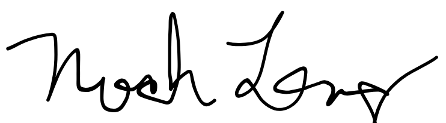

# Cover Letter

## Noah Long
407-111-2222  |  no326134@ucf.edu  |  Oviedo, FL    

April 18, 2026    

Hornblower Group  
4901 Vineland Road, Suite 200  
Millenia Park One  
Orlando, FL 32811  

Dear Hiring Manager,  

I am writing this letter to express my interest in the UX/UI designer position currently available with Hornblower. I am a student at the University of Central Florida working towards a degree in Interdisciplinary Studies, with a focus on UI/UX.  

My coursework this semester has included developing a design project where I am designing elements for a website. Through my coursework at UCF and a technical writing internship this semester, I have gained document writing skills utilizing Adobe InDesign. I am studying design principles and applying them to the projects I work on. For example, my current project is strengthening my design skills and giving me hands-on training with programs like Figma.  

Beyond my technical skills, my long-term position as an Operations Supervisor at the Addition Financial Arena has helped me develop relevant skills, such as problem solving, team communication, and time management, that will help me in all future work environments.  

I am particularly interested in this position with Hornblower because of the company’s focus on creating strong user experiences within the travel and entertainment space. I am interested in how digital design can improve how users interact with services, and I would value the opportunity to contribute to that process. With my background in UX/UI coursework and technical writing, I believe I can bring both design thinking and clear communication to support your team.  

I welcome the opportunity to further discuss my qualifications for the role.  

Sincerely,  

 
Noah Long
