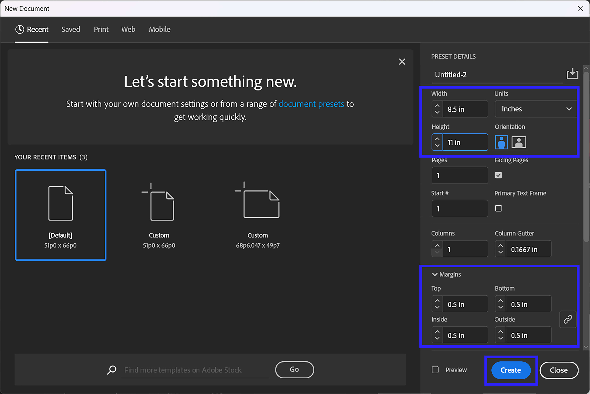
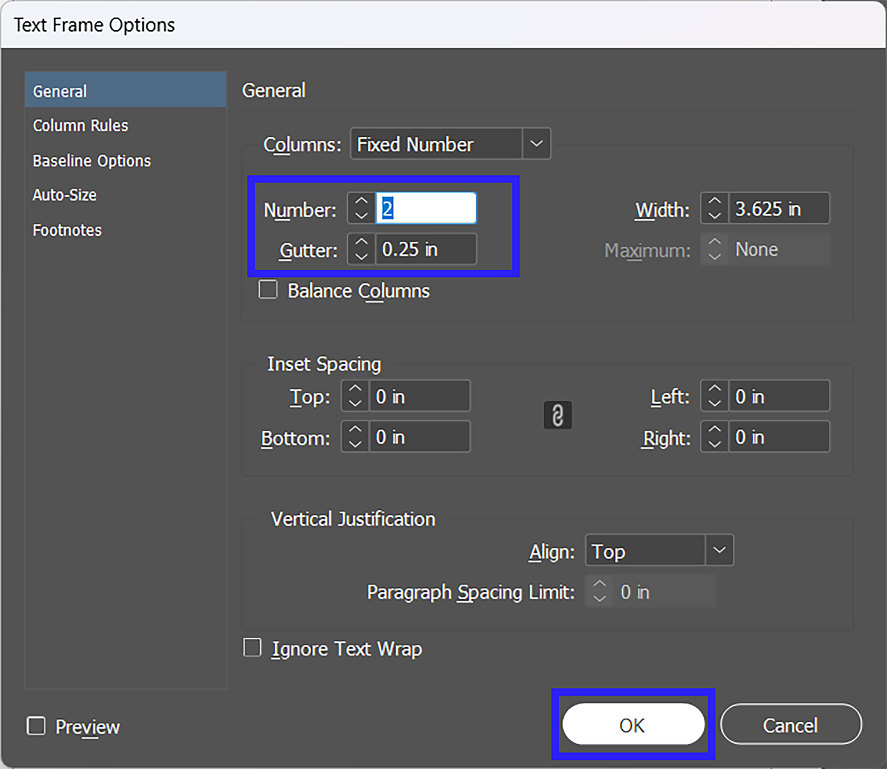

# Instructions

## How to Create a 2-Column Layout in Adobe InDesign
This tutorial explains how to create a two-column text layout and vertically justify the text in Adobe InDesign. These steps are designed for beginners who are new to working with text frames and layout settings.

## Materials
- Adobe InDesign  
- Text content to place into the document  

## Instructions

1. In Adobe InDesign, select **File > New > Document** to create a new document.  

     
   *Figure 1. New document setup window. (Source: Author)*  

2. Set the page size, margins, and other document settings. 

3. Click **Create** to open the document.  

4. Select the **Type Tool** from the toolbar.  

5. Click and drag to create a text frame in the desired size. The purple lines on the page represent the margin guides.  

6. Go to **Object > Text Frame Options** to open the Text Frame Options panel.  

7. Set the number of columns to **2**.  

8. Adjust the gutter value to control spacing between columns.  

     
   *Figure 2. Text Frame Options panel showing column settings. (Source: Author)*  

9. Click **OK** to apply the column settings. 

