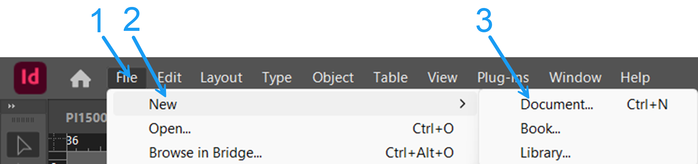
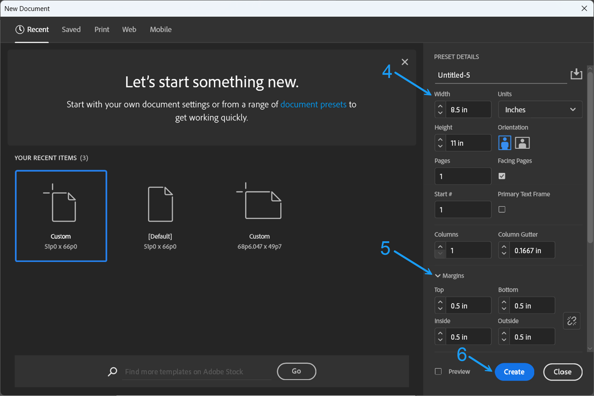
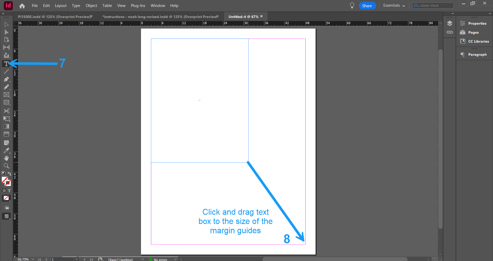
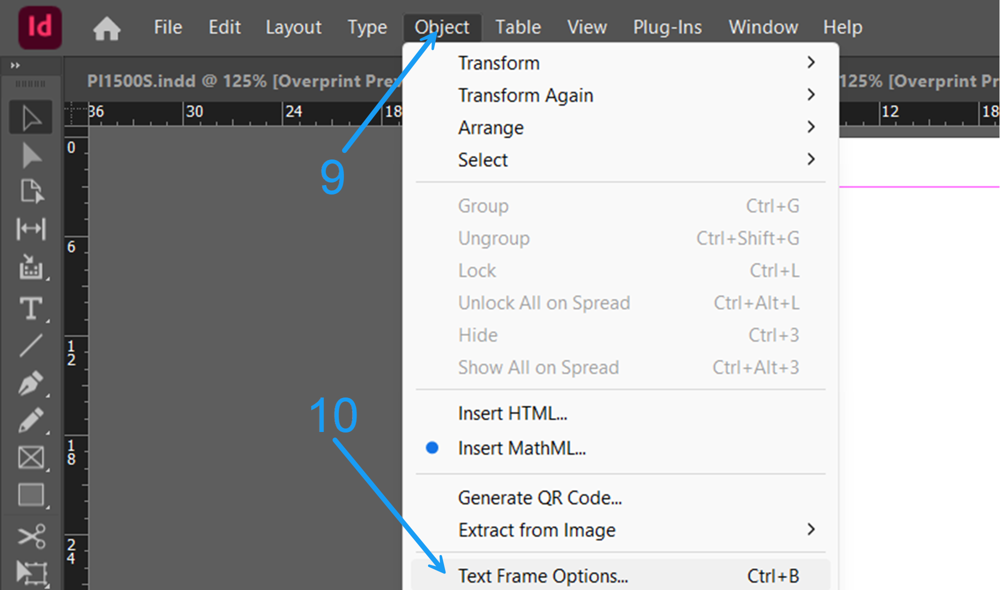
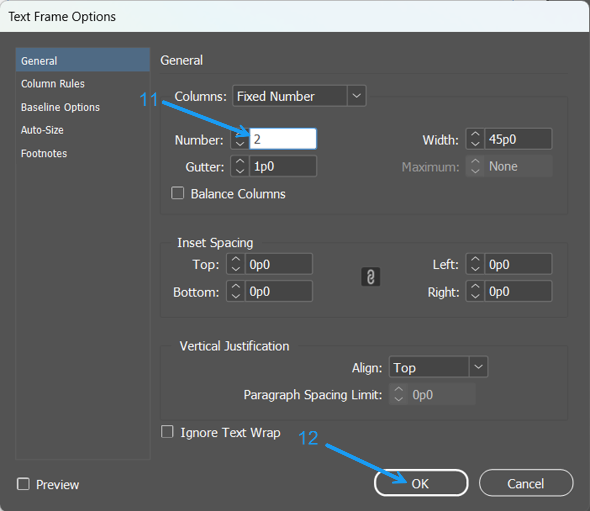

# Instructions
This sample represents a step-by-step instructional document explaining how to create a two-column layout in Adobe InDesign. The document focuses on clarity, visual support, and organization for beginner users.  
 📄[View PDF](instructions.pdf)
## How to Create a 2-Column Layout in Adobe InDesign

Step 1: Click **File** in the top menu.  

Step 2: Click **New**.  

Step 3: Click **Document**.

  
*Figure 1: Create new document. (Source: Noah Long)*

Step 4: Set the page size to **8.5 x 11" portrait**.  

Step 5: Set all four margins to **0.5"**.  

Step 6: Click **Create** to open the document.

  
*Figure 2: New document page settings. (Source: Noah Long)*

Step 7: Click the **Type Tool** in the left toolbar.  

Step 8: Click and drag from the top left corner to the bottom right corner to create a text frame.

  
*Figure 3. Size text box to screen. (Source: Noah Long)*

Step 9: Click **Object** in the top menu.  

Step 10: Click **Text Frame Options** to open the panel.

  
*Figure 4: Opening Text Frame Options panel. (Source: Noah Long)*

Step 11: Set the number of columns to **2**.  

Step 12: Click **OK** to apply the column settings.

  
*Figure 5: Column settings in Text Frame Options panel. (Source: Noah Long)*

Step 13: Type or paste your text into the frame. It will automatically flow between the columns.  

Step 14: Click **File** in the top menu.  

Step 15: Click **Save** to save your document.
